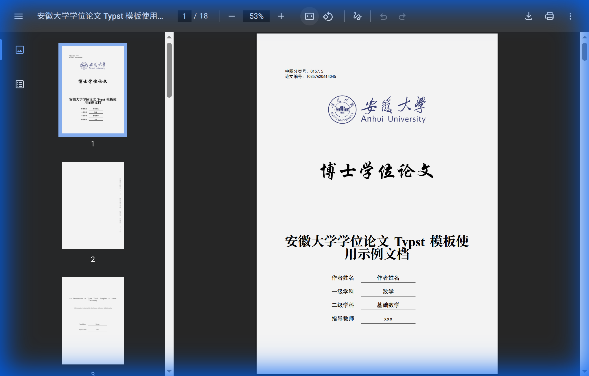
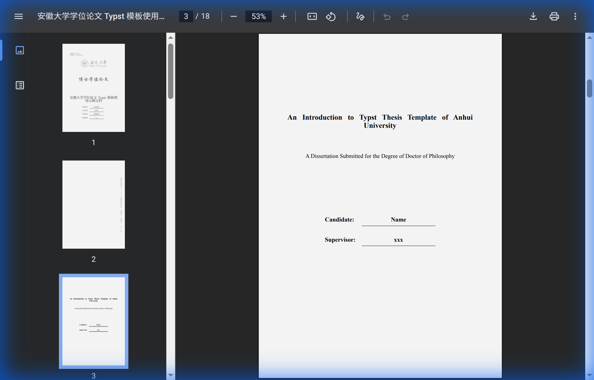
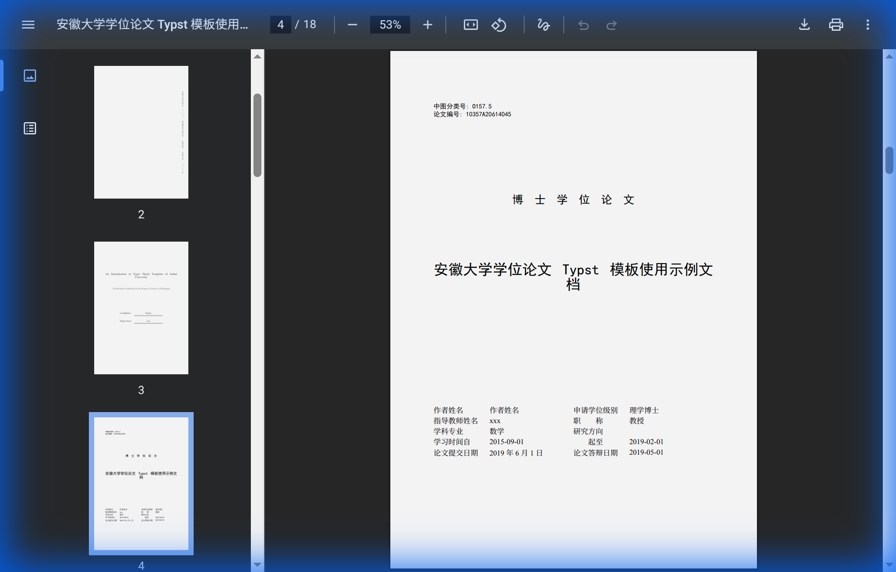
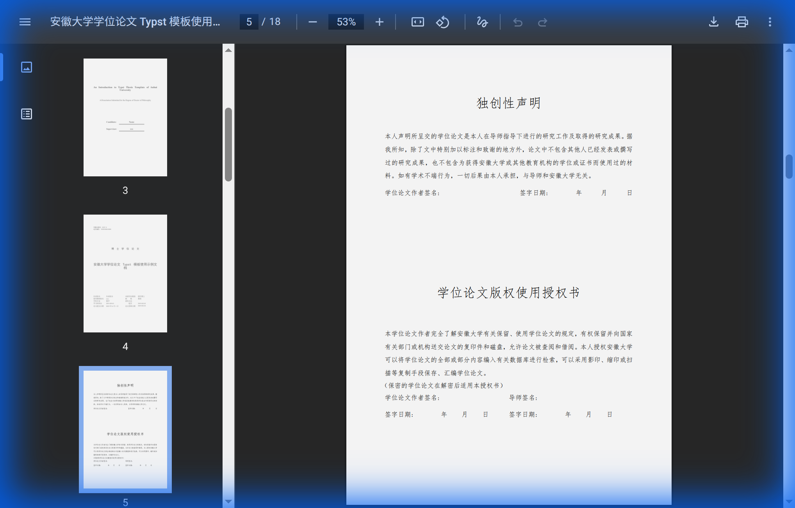
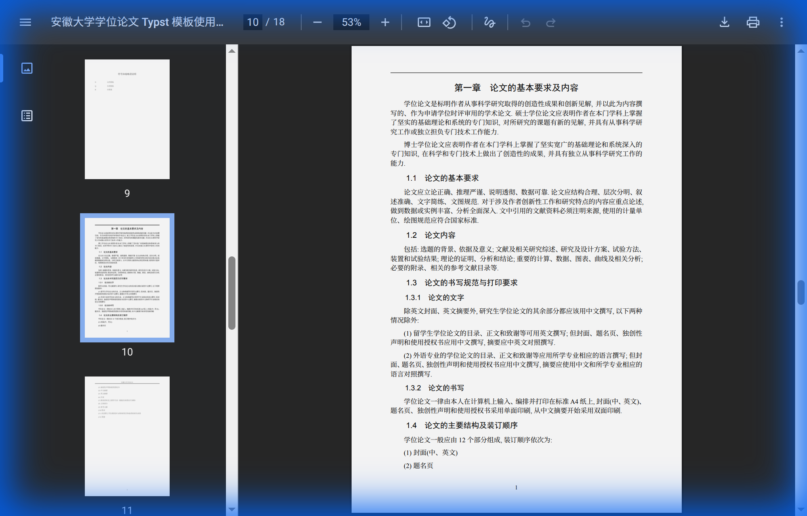
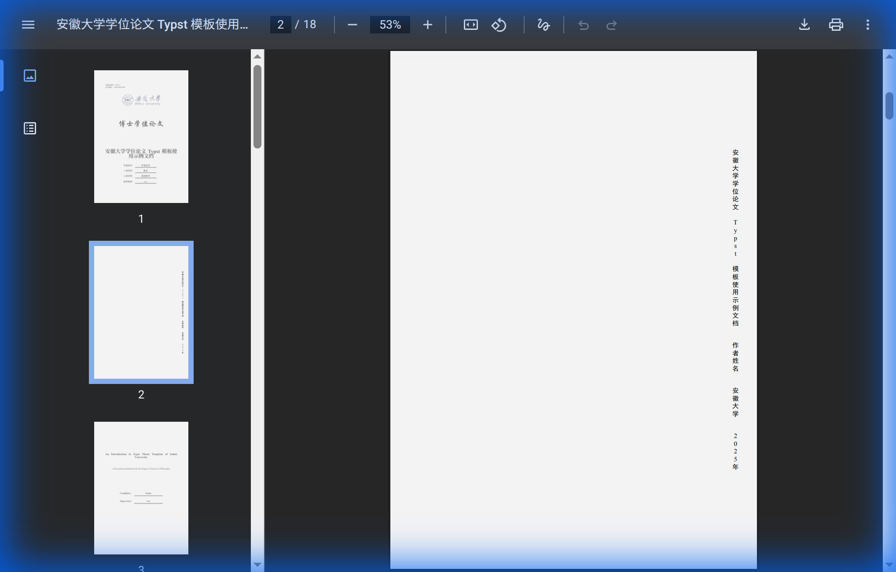

# ahuthesis-typst

**安徽大学学位论文 Typst 模板** — 基于 [Typst](https://typst.app/) 排版系统

> 本项目是 [ahuthesis](https://github.com/ahhylau/ahuthesis) LaTeX 模板的 Typst 移植版本，旨在提供一套简洁、易用、高质量的安徽大学学位论文模板。

---

## ✨ 特性

- 📝 支持 **博士**、**硕士**、**本科**、**博士后** 四种学位论文类型
- 🎓 区分 **学术型** 和 **专业型** 学位（硕士）
- 🌐 支持 **中文** / **英文** 双语切换
- 🖨️ 支持 **打印版** / **电子版** 输出
- 📖 自动生成封面、书脊、提名页、版权声明、目录等
- 📚 内置 GB/T 7714-2015 参考文献格式
- 🔧 高度模块化，一个函数配置所有参数

---

## 📸 效果展示

<p align="center">
  
  
</p>
<p align="center">
  
  
</p>
<p align="center">
  
  
</p>

---

## 📋 前置要求

### 安装 Typst

请确保系统已安装 Typst **≥ 0.12**。推荐使用以下方式安装：

```bash
# macOS / Linux (Homebrew)
brew install typst

# Arch Linux
pacman -S typst

# Cargo (跨平台)
cargo install --git https://github.com/typst/typst --locked typst-cli

# 或从 GitHub Releases 下载预编译二进制
# https://github.com/typst/typst/releases
```

### 字体要求

模板依赖以下字体，请确保系统中已安装：

| 用途 | 字体名称 | 备注 |
|------|----------|------|
| 中文宋体 | SimSun / Noto Serif CJK SC / Source Han Serif SC | 正文主字体 |
| 中文黑体 | SimHei / Noto Sans CJK SC / Source Han Sans SC | 标题字体 |
| 中文楷体 | KaiTi / STKaiti | 部分引用使用 |
| 中文仿宋 | FangSong | 版权声明等 |
| 西文衬线 | Times New Roman / TeX Gyre Termes | 西文正文 |
| 西文无衬线 | Arial / TeX Gyre Heros | 西文标题 |
| 华文行楷 | STXingkai | 封面大标题 (已内置于 `fonts/` 目录) |

> [!TIP]
> **Linux 用户**: 推荐安装 Noto CJK 字体系列 (`noto-fonts-cjk`)。如使用 Arch Linux:
> ```bash
> pacman -S noto-fonts-cjk noto-fonts
> ```

> [!NOTE]
> 项目 `fonts/` 目录下已包含华文行楷字体 (`STXingka.ttf`)，编译时 Typst 会自动搜索该目录。其余字体需自行安装到系统中。

---

## 🚀 快速开始

### 1. 获取模板

```bash
git clone https://github.com/your-username/ahu-thesis-typst.git
cd ahu-thesis-typst
```

### 2. 选择模板

项目提供了两种预配置的论文模板：

| 模板文件 | 学位类型 | 说明 |
|----------|----------|------|
| `templates/master.typ` | 硕士学位论文 | 学术型/专业型硕士，5 章结构 |
| `templates/doctor.typ` | 博士学位论文 | 博士论文，7 章结构，含书脊页 |

将模板复制到项目根目录作为你的论文主文件：

```bash
# 硕士论文
cp templates/master.typ main.typ

# 博士论文
cp templates/doctor.typ main.typ
```

> [!IMPORTANT]
> 复制到根目录后，请将 `main.typ` 中的 `#import "../lib.typ": *` 修改为 `#import "lib.typ": *`，将 bibliography-file 中的 `"../refs.bib"` 修改为 `"refs.bib"`。

### 3. 编辑论文配置

打开 `main.typ`，修改 `ahuthesis.with(...)` 中的参数：

```typst
#show: ahuthesis.with(
  degree: "master",
  title: "你的论文标题",
  author: "你的姓名",
  // ... 更多参数见下方配置说明
)
```

### 4. 撰写正文

在配置块之后直接撰写正文内容：

```typst
= 绪论

== 研究背景与意义

在此撰写正文内容...

== 国内外研究现状

引用参考文献 @key1 @key2.
```

### 5. 编译

```bash
typst compile main.typ
```

编译后将生成 `main.pdf` 文件。

> [!TIP]
> 使用 `typst watch main.typ` 可以在保存时自动重新编译，实现实时预览。

---

## ⚙️ 配置参数详解

所有参数均通过 `ahuthesis.with(...)` 传入。以下是完整的参数说明。

### 基本设置

| 参数 | 类型 | 默认值 | 可选值 | 说明 |
|------|------|--------|--------|------|
| `degree` | `str` | `"doctor"` | `"bachelor"` \| `"master"` \| `"doctor"` \| `"postdoc"` | 学位类型 |
| `degree-type` | `str` | `"academic"` | `"academic"` \| `"professional"` | 学位类别（学术型/专业型） |
| `language` | `str` | `"chinese"` | `"chinese"` \| `"english"` | 论文主语言 |
| `output` | `str` | `"print"` | `"print"` \| `"electronic"` | 输出格式 |

### 论文信息

| 参数 | 类型 | 说明 | 示例 |
|------|------|------|------|
| `title` | `str` | 中文标题 | `"基于深度学习的图像分类研究"` |
| `title-en` | `str` | 英文标题 | `"Image Classification Based on Deep Learning"` |
| `author` | `str` | 作者姓名 | `"张三"` |
| `author-en` | `str` | 作者英文名 | `"San Zhang"` |
| `student-id` | `str` | 学号 | `"A20614045"` |
| `supervisor` | `str` | 导师姓名 | `"李四"` |
| `supervisor-en` | `str` | 导师英文名 | `"Si Li"` |
| `professional-rank` | `str` | 导师职称 | `"教授"` |

### 学科信息

| 参数 | 类型 | 说明 | 示例 |
|------|------|------|------|
| `department` | `str` | 培养单位 | `"计算机科学与技术学院"` |
| `discipline` | `str` | 一级学科 | `"计算机科学与技术"` |
| `discipline-en` | `str` | 一级学科（英文） | `"Computer Science"` |
| `sub-discipline` | `str` | 二级学科 | `"人工智能"` |
| `sub-discipline-en` | `str` | 二级学科（英文） | `"Artificial Intelligence"` |
| `professional-field` | `str` | 专业学位领域（专业型硕士使用） | `"电子信息"` |
| `degree-category` | `str` | 学位类别名称 | `"工学博士"` / `"理学硕士"` |
| `degree-category-en` | `str` | 学位类别名称（英文） | `"Doctor of Engineering"` |

### 日期与编号

| 参数 | 类型 | 默认值 | 说明 | 示例 |
|------|------|--------|------|------|
| `clc` | `str` | `""` | 中图分类号 | `"TP391.4"` |
| `date` | `datetime` | `datetime.today()` | 论文提交日期 | `datetime(year: 2025, month: 6, day: 1)` |
| `start-date` | `str` | `none` | 学习开始日期 | `"2021-09-01"` |
| `end-date` | `str` | `none` | 学习结束日期 | `"2024-06-01"` |
| `defense-date` | `str` | `none` | 答辩日期 | `"2024-05-20"` |

### 封面选项

| 参数 | 类型 | 默认值 | 说明 |
|------|------|--------|------|
| `include-spine` | `bool` | `false` | 是否生成书脊页（博士论文建议开启） |
| `spine-date` | `str` | `""` | 书脊年份 |
| `nocolor` | `bool` | `false` | 是否使用黑白 Logo（打印版可开启） |

### 参考文献

| 参数 | 类型 | 默认值 | 说明 |
|------|------|--------|------|
| `bibliography-file` | `str` | `none` | BibTeX 文件路径 |
| `bibliography-style` | `str` | `"gb-7714-2015-numeric"` | 参考文献样式 |

> [!NOTE]
> Typst 内置支持 GB/T 7714-2015 标准的数字编号格式 (`gb-7714-2015-numeric`) 和作者-年份格式 (`gb-7714-2015-author-date`)。

### 前置内容

| 参数 | 类型 | 说明 |
|------|------|------|
| `abstract-zh-body` | `content` | 中文摘要内容 |
| `abstract-zh-keywords` | `array` | 中文关键词数组 |
| `abstract-en-body` | `content` | 英文摘要内容 |
| `abstract-en-keywords` | `array` | 英文关键词数组 |
| `denotation-items` | `array` | 符号表项，格式为 `(($符号$, "说明"), ...)` |

### 后置内容

| 参数 | 类型 | 说明 |
|------|------|------|
| `acknowledgements-body` | `content` | 致谢内容 |
| `resume-body` | `content` | 个人简历及学术成果 |
| `appendix-body` | `content` | 附录内容（可选） |

---

## 📁 项目结构

```
ahu-thesis-typst/
├── main.typ                 # 论文主文件 (使用示例)
├── lib.typ                  # 模板入口，统一导出所有模块
├── refs.bib                 # 参考文献数据库
│
├── templates/               # 预配置模板
│   ├── master.typ           #   硕士学位论文模板
│   └── doctor.typ           #   博士学位论文模板
│
├── pages/                   # 页面模块
│   ├── cover.typ            #   封面 & 书脊
│   ├── titlepage.typ        #   提名页 (中文/英文)
│   ├── copyright.typ        #   版权声明页
│   ├── abstract-zh.typ      #   中文摘要
│   ├── abstract-en.typ      #   英文摘要
│   ├── denotation.typ       #   符号表
│   ├── acknowledgements.typ #   致谢
│   └── resume.typ           #   个人简历
│
├── layouts/                 # 布局模块
│   ├── page-setup.typ       #   页面尺寸与页边距
│   ├── header-footer.typ    #   页眉页脚
│   └── heading-styles.typ   #   标题样式
│
├── utils/                   # 工具模块
│   ├── fonts.typ            #   字体配置
│   ├── i18n.typ             #   国际化文本
│   ├── numbering-utils.typ  #   编号工具
│   └── theorem.typ          #   定理环境
│
├── figures/                 # 图片资源
│   ├── ahulogo.pdf          #   安徽大学彩色 Logo
│   ├── ahublack.pdf         #   安徽大学黑白 Logo
│   └── screenshots/         #   README 截图
│
├── fonts/                   # 字体文件
│   └── STXingka.ttf         #   华文行楷 (封面标题用)
│
└── README.md                # 本文件
```

---

## 📝 使用指南

### 正文章节

使用 Typst 的标题语法组织章节结构：

```typst
= 一级标题（章）

== 二级标题（节）

=== 三级标题（小节）

正文内容。可以在此引用参考文献 @key1。
```

### 图片插入

```typst
#figure(
  image("figures/example.png", width: 80%),
  caption: [图片说明文字],
) <fig:label>

如 @fig:label 所示...
```

> [!TIP]
> 建议矢量图使用 PDF / SVG 格式，照片使用 JPG 格式，其他栅格图使用 PNG 格式。

### 表格

推荐使用三线表：

```typst
#figure(
  table(
    columns: 3,
    stroke: none,
    table.hline(stroke: 1.5pt),
    table.header([*列 1*], [*列 2*], [*列 3*]),
    table.hline(stroke: 1pt),
    [数据 1], [数据 2], [数据 3],
    [数据 4], [数据 5], [数据 6],
    table.hline(stroke: 1.5pt),
  ),
  caption: [三线表示例],
) <tab:example>
```

### 数学公式

```typst
行内公式 $E = m c^2$ 示例。

行间公式：

$ integral_0^infinity e^(-x^2) dif x = sqrt(pi) / 2 $ <eq:gauss>

如公式 @eq:gauss 所示。
```

### 参考文献

在 `refs.bib` 文件中添加 BibTeX 条目，然后在正文中使用 `@key` 引用：

```typst
这一方法已在相关工作中得到验证 @wang2023deep。
```

### 符号表

通过 `denotation-items` 参数传入符号及其说明：

```typst
denotation-items: (
  ($RR$, "实数集"),
  ($NN$, "自然数集"),
  ($bold(A)$, "矩阵"),
),
```

---

## 🔧 常见问题

### Q: 编译时出现 "unknown font family" 警告

这表示系统中未安装对应字体。Typst 会自动回退到其他可用字体，但为了最佳效果，请安装上述字体要求中列出的字体。

### Q: 如何切换学术型/专业型硕士？

修改 `degree-type` 参数：

```typst
degree-type: "professional",  // 专业型硕士
```

专业型硕士的封面会显示"专业硕士学位论文"，信息表格也会相应调整（显示"专业学位类别"和"专业学位领域"）。

### Q: 如何只生成电子版（不含书脊页）？

```typst
output: "electronic",
include-spine: false,
```

### Q: 如何添加附录？

通过 `appendix-body` 参数传入附录内容：

```typst
appendix-body: [
  == 附录 A：补充数据

  更多数据和图表...
],
```

### Q: 如何使用模板编写本科毕业论文？

将 `degree` 参数设置为 `"bachelor"` 即可。本科论文的封面、标题页和页面布局会自动调整。

```typst
degree: "bachelor",
```

### Q: 中图分类号在哪里查？

可在 [中国图书馆分类法](http://ztflh.xhma.com/) 网站查询。常见分类号：

- 计算机科学：TP3
- 数学：O1
- 物理学：O4
- 电子工程：TN

---

## 📦 论文组成部分

模板按照学校规范自动生成以下部分（按装订顺序）：

| 序号 | 部分 | 说明 |
|------|------|------|
| 1 | 封面 | 研究生含学校 Logo 和学位论文大标题 |
| 2 | 书脊 | 可选，竖排标题、作者、学校、年份 |
| 3 | 英文提名页 | 英文标题、学位类别、作者与导师 |
| 4 | 中文提名页 | 中文信息表格：作者、导师、学科等 |
| 5 | 版权声明 | 独创性声明 & 使用授权书 |
| 6 | 中文摘要 | 摘要正文 + 关键词 |
| 7 | 英文摘要 | Abstract + Keywords |
| 8 | 目录 | 自动生成，三级标题 |
| 9 | 符号表 | 可选 |
| 10 | **正文** | 用户撰写 |
| 11 | 参考文献 | 自动从 `.bib` 生成 |
| 12 | 附录 | 可选 |
| 13 | 致谢 | |
| 14 | 个人简历 | 含学术成果 |

---

## ⚠️ 重要提醒

1. 本模板未经学校相关部门审核及授权，使用前请务必斟酌。
2. 任何由于使用本模板而引起的论文格式审查问题均与本模板作者无关。
3. 建议在最终提交前仔细核对格式要求，必要时进行手动微调。

---

## 🤝 贡献

如果您有任何改进意见或功能需求，欢迎提交 [Issue](https://github.com/ahhylau/ahuthesis/issues) 或 [Pull Request](https://github.com/ahhylau/ahuthesis/pulls)。

---

## 📄 许可证

本项目基于 [LPPL-1.3c](https://www.latex-project.org/lppl/lppl-1-3c/) 许可证分发。
